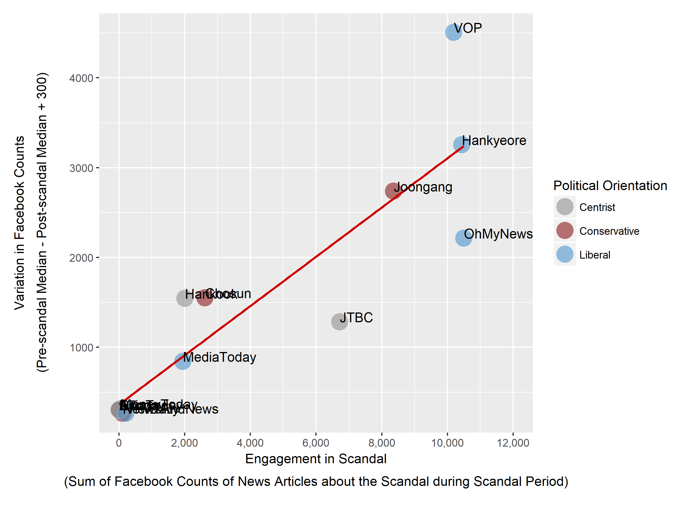
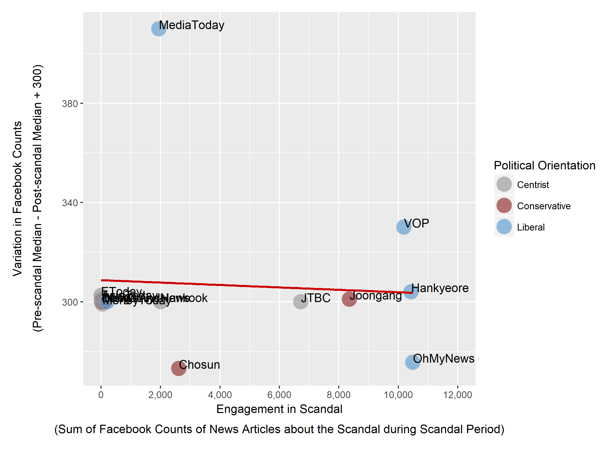

## Reputation of News Organizations and News Consumption

### Abstract

While past research suggests that people demand for politically biased news, surveys show that people also expect the media to play as impartial watchdogs. This paper presents an evidence that while like-mindedness is a major determinant of which news source to consume, people occasionally update their beliefs on news outlets and change their news sources accordingly. I show this claim with the data from South Korean Presidential impeachment in 2017. Using average Facebook share counts as a measure of the reputation of a media organization, I investigate the variation of media outlets’ reputation before and after the Presidential scandal period. I find that a news organization’s variation Facebook counts across the two periods has a significant correlation with how actively the news organization engaged in reporting the scandal. I also find that such correlation is seen across different topic areas (politics, economy, crime, sports and weather).

### Key results

As a measure of a news organization’s reputation, I used Facebook counts. Here, a Facebook count of a news organization for a date refers to the sum of how many times the news organizations news articles published on that day have been shared (either shared, liked, or commented) on Facebook. We discuss below the validity of using Facebook counts as a measure of media organization’s reputation.

The left hand side term, Variation in Reputation, was calculated as the difference in mean Facebook counts in the pre- and post-scandal periods. And, the measurement for Engagement during Scandal was calculated as the sum of Facebook counts for news articles during the scandal period (Oct 2016 to Mar 2017) whose titles include relevant keywords in their news titles. The resulting analysis is shown in the figure below.

